# Programa de Conviencia Espacial: Documento de Diseño

---
## 1. Introducción:
Programa de Convivencia Espacial es un party-game en el que los jugadores controlarán a distintos astronautas para pelearse por las distintas estancias de una estación espacial.
El juego se desarrollará en rápidas rondas en las que los jugadores se valdrán de sus habilidades para disparar armas y lanzar objetos del mobiliario además de moverse en entornos sin gravedad, impulsándose desde paredes, objetos e incluso los cuerpos de sus enemigos.

---
## 2. Historia:
De entre todos los experimentos a los que te podías haber apuntado para sacarte unos euros de más, has acabado en el peor de todos. 
Bienvenido al PCE (Programa de Convivencia Espacial), en el que, durante varios y tortuosos meses, convivirás con gente de todo el mundo, con todos los
choques (culturales y físicos) que eso conlleva. ¿Lograrás volver a la tierra siendo el mejor (y más rico) compañero de piso espacial?

---
## 3. Personajes:
Cada jugador encarna a un astronauta participante del PCE
Esto se verá reflejado en su aspecto físico, ya que su traje llevará bordada la bandera de su nación correspondiente.

---
## 4. Gameplay:

### 4.1 Controles:
El juego se puede controlar de distintas maneras:

**Controles con mando**

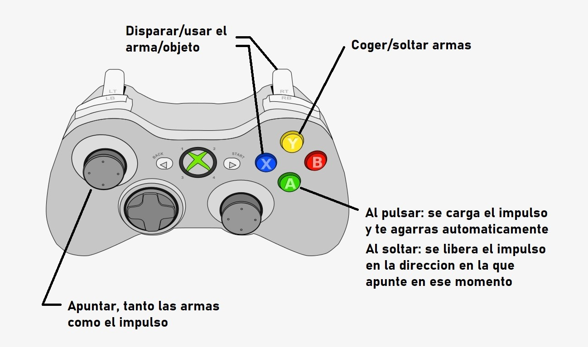

**Controles con teclado (hasta 2 jugadores)**

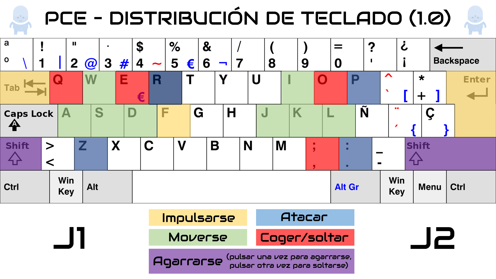

**Controles con teclado y ratón**

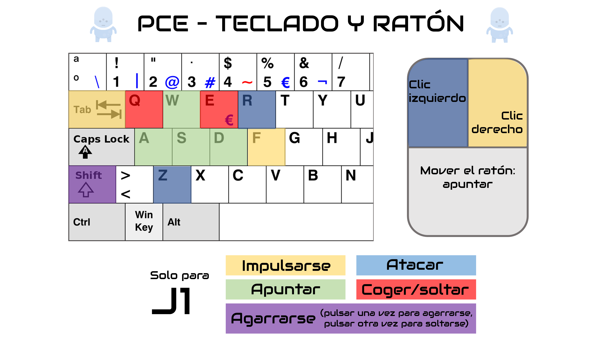

### 4.2 Menú principal

Al principio del juego, al jugador se le presenta un menú principal jugable. Es una sala con 4 salientes que representan distintas puertas. Al ponerse encima de cada una, llevarán al jugador a la sección correspondiente (créditos, salir del juego, opciones o jugar).

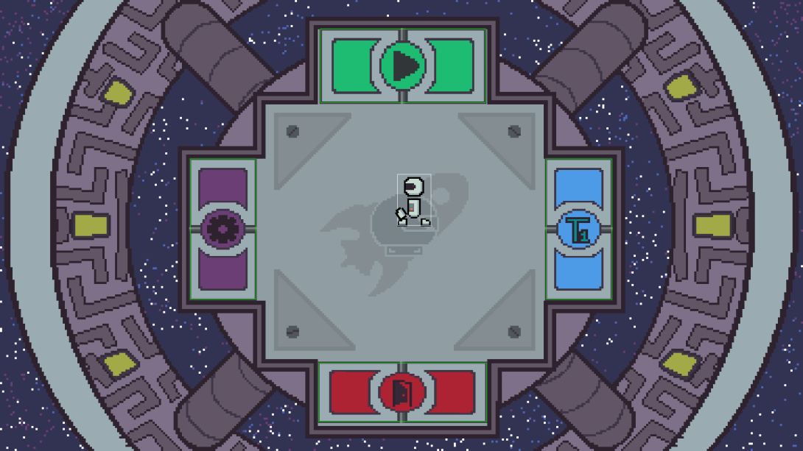

Al comenzar a jugar, antes de seleccionar los parámetros de la partida los jugadores elegirán su número de jugador y su método de control en un lobby. Después de eso, los jugadores podrán empezar la partida.

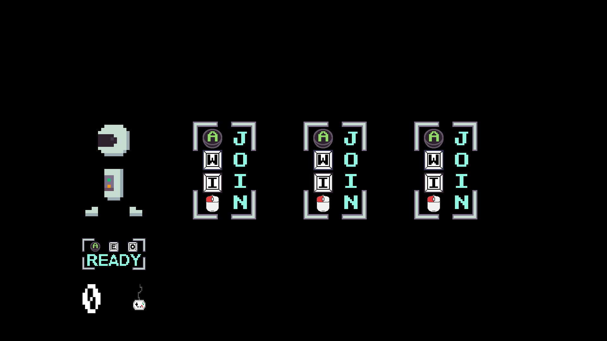

### 4.3 Formato de partida: 

- **Clásico:** Al comenzar la partida, el jugador 1 elegirá el número de rondas que se van a jugar. A continuación, se elegirá para cada ronda un modo de juego y un escenario. 

Las rondas se jugarán seguidas, con una pequeña intermisión entre ellas en la que se informará del número de rondas que ha ganado cada participante.

### 4.4 Modos de juego:

*Cada módulo se podrá jugar de varias maneras distintas. Estos cambian el objetivo de la partida y la dinámica de juego.*

*En cada apartado se muestra una captura de lo que sería un momento cualquiera en cada modo.*

#### Tutorial
Este modo de juego se compone de una arena simple en la que van apareciendo mensajes que le dicen a los jugadores cómo realizar las acciones básicas del juego.

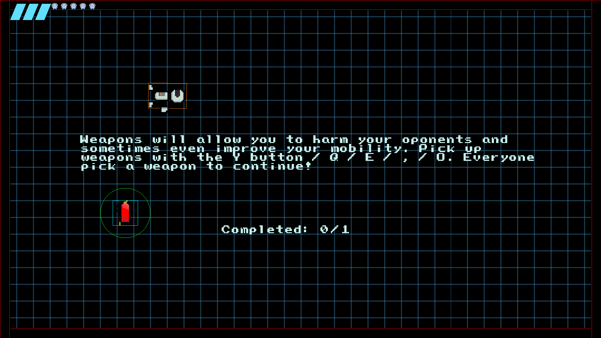

#### Por tiempo:
Al matar a un enemigo, los jugadores obtendrán un punto. Al terminar este tiempo, quien tenga más puntos ganará la ronda.

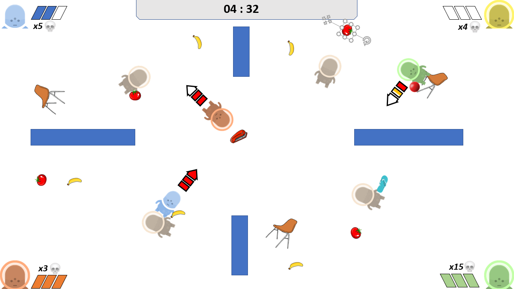

#### Por vidas:
Cada jugador tendrá una cantidad limitada de vidas. El último que quede con vida gana la ronda.

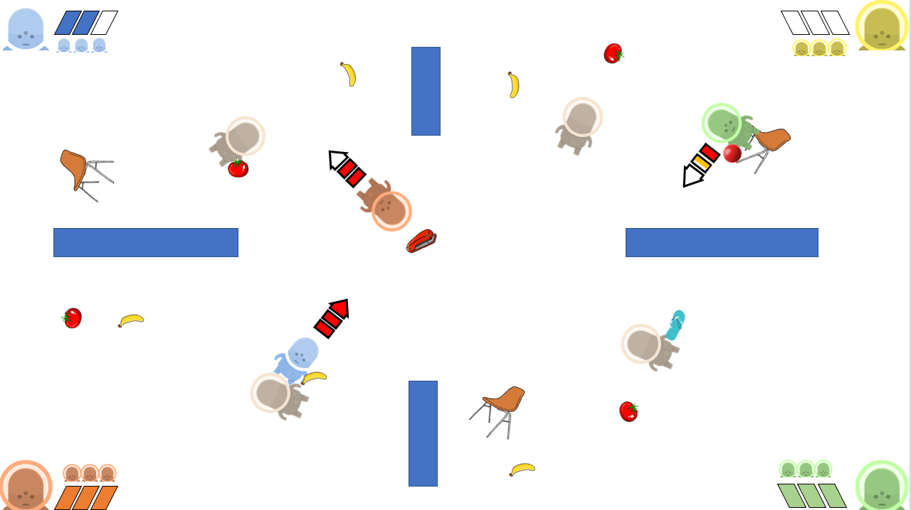

#### ¡Pelea por el mando!:

En un punto del módulo habrá un mando por el que los jugadores se pelearán por recoger.
Al recogerlo, el jugador empezará a sumar puntos hasta llegar al tiempo objetivo.
Cuando un jugador llegue al tiempo objetivo, acabará la ronda en el módulo.

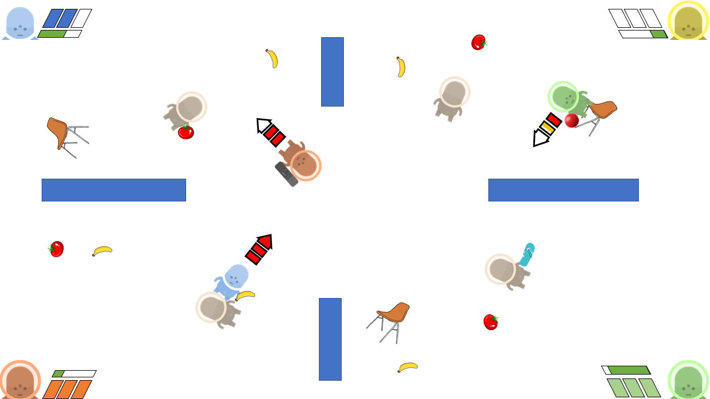

#### Wi-Fight:

En el módulo habrá un router wi-fi que se moverá por el escenario rebotando por las paredes.
El objetivo de los jugadores será descargar sus archivos, para lo que tendrán que acercarse al router. Cuantos más jugadores haya en el área del router, más lentamente descargarán los datos. Cuanto más cerca estén del router, más rápido progresará su descarga.

Cuando un jugador consiga descargar todos sus archivos, acabará la ronda en el módulo.

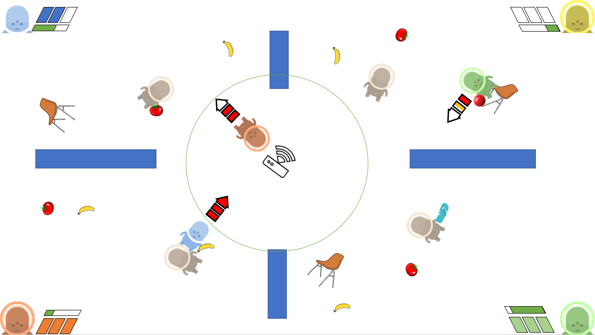

#### Capitalismo:

En el escenario aparecen roombas que irán soltando monedas que los jugadores deberán recoger. En este modo de juego los jugadores son invulnerables y cuando son golpeados pierden dinero y son empujados. Al acabarse el tiempo, el jugador con más dinero gana.

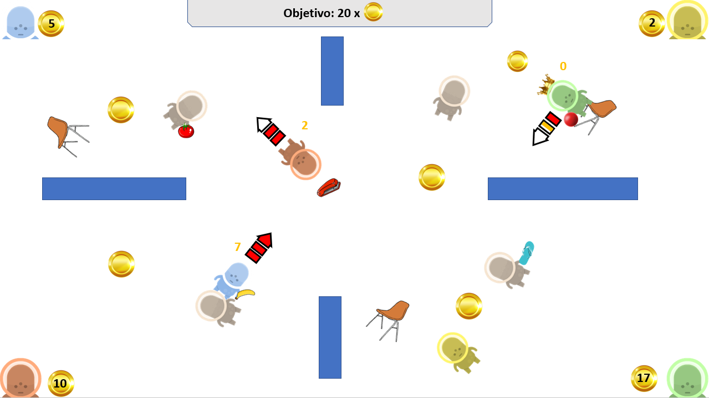

### 4.5 Mecánicas:

*En este apartado se exploran las acciones que el jugador puede ejercer*

#### 4.5.1 Vida:
Los jugadores dispondrán de 3 puntos de vida (excepto en el modo Capitalismo). Irán perdiendo estos puntos conforme vayan siendo impactados por fuego enemigo. Cuando pierdan todos los puntos de vida, quedarán inconscientes (dejando su cadáver en el lugar donde murieron) y al cabo de un breve tiempo, volverán a aparecer en su punto de respawn.

#### 4.5.2 Desplazamiento por el escenario:

#### Impulsos:
Al mantener un botón, el jugador cargará una flecha de impulso. Su dirección se podrá controlar con el joystick. La flecha está dividida en 3 segmentos de potencia. Si el jugador está volando por el aire, solo podrá cargarla hasta la mitad. Si está agarrado a algo, podrá cargarla entera, pudiendo aprovecharse de un impulso más fuerte.

*Ejemplo de un jugador cargando su salto*

Si el jugador libera el impulso en una plataforma, saldrá disparado en la dirección de la flecha.

Si el jugador libera el impulso en el aire, soltará una flatulencia para conseguir redirigirse hacia una dirección. Sin embargo, si el jugador está en el aire pero libera el salto junto a un objeto suficientemente grande como un cadáver, se impulsará desde el mismo, con la potencia de un salto desde una plataforma. El objeto móvil desde el que se impulse saldrá disparado en dirección contraria.

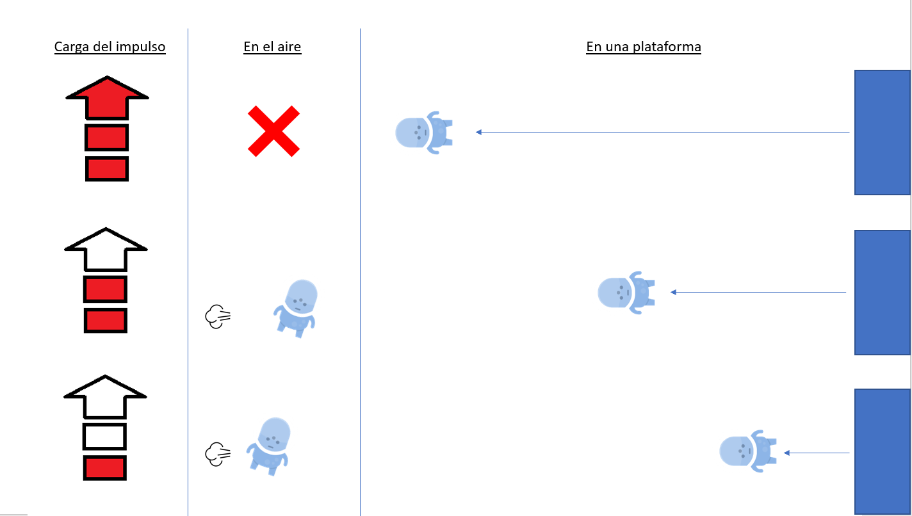

*Gráfica que muestra la potencia de los saltos en diversas situaciones*

#### Agarrarse a superficies:

El jugador puede agarrarse a una pared o a un objeto pesado volando por el nivel para detenerse y poder terminar de cargar su impulso.
Al agarrarse, sus fuerzas se suman y se modificará la trayectoria de ambos.

#### Basura espacial:

Objetos que se mueven por el mapa. Si son suficientemente grandes, los jugadores se podrán agarrar a ellos.
Cuando impactan con un jugador, si este no se agarra, se comportan como en una colisión normal.
Si el objeto va a mucha velocidad y el jugador no se agarra, muere instantáneamente debido al impacto.

#### Cadáveres:

Cuando un jugador es derrotado, su cadáver se queda en su lugar volando a la deriva, soltando el arma que llevaba. Pasado un breve tiempo de respawn, reaparecerá desde su punto de spawn.
Los cadáveres actuarán como un objeto sólido, permitiendo impulsarse desde los mismos.
Por último, si un jugador se impulsa desde un cadáver hacia una dirección, el cadáver saldrá impulsado hacia la dirección contraria, convirtiéndose en un proyectil para el enemigo. Si un cadáver con alta velocidad impacta con un jugador, le hará una determinada cantidad de daño dependiendo de su velocidad y le desarmará.

#### 4.5.3 Armas y combate:

*Los jugadores podrán recoger armas que aparecen por el escenario. Al pasar de una ronda a otra los jugadores no conservarán las armas obtenidas.*

- **Lanzar armas:** El jugador puede lanzar un arma para desarmar a los enemigos con el impacto, hacer daño (según el arma) y así poder coger armas nuevas. Al cabo de un tiempo, si el arma no tiene munición restante, desaparecerá para limpiar el escenario.

&#x200C; 

- **Recoger armas:** El jugador puede recoger un arma de un cadaver o del entorno con la pulsación de un botón. Si el jugador ya lleva un arma, la intercambiará por el arma que recoge y la antigua se quedará flotando por el escenario.

&#x200C; 

- **Aparición de armas por el escenario:** Las armas aparecerán en puntos fijos del escenario. Estas armas estarán sujetas a las físicas, de modo que un jugador podrá lanzar un objeto a las mismas para moverlas de posición si él lo desea. 
Cuando un jugador recoge un arma, empezará el tiempo de respawn del lugar donde la recogió. 

&#x200C;

**Tipos de armas:** *Actualmente las armas se dividen en 3 subclases*

**● Armas cuerpo a cuerpo:**

**- Confeti:** Arma de corto alcance que ejerce 2 puntos de daño y aplica un gran impulso al otro jugador (onda expansiva).

**- La chancla:** Arma cuerpo a cuerpo de corto alcance que hace una cantidad de daño inversamente proporcional a la vida del jugador que la usa (1 punto de daño si se tienen 3 de vida, 2 si se tienen 2 puntos de vida y 3 si solo queda 1 punto de vida).

**- Toalla mojada** Arma cuerpo a cuerpo de medio alcance que hace 1 punto de daño al anemigo y además le empuja una grán distancia. La tolla solo hace su efecto en una pequeña área al extremo final de su rango.

**● Armas a distancia:**

**- Objetos contundentes:** Son armas arrojadizas de un solo uso repartidos por el escenario que hacen 1 punto de daño. Estos pueden venir en varias formas (rocas, ladrillos, libros, tuppers congelados...) pero su tamaño será similar.

**- Mancuernas:** Arma de un solo uso que al impactar contra el enemigo ejerce 2 puntos de daño. Su velocidad es menor que la de los objetos contundentes.

**-Plátanos pistola:** Arma de un solo uso que dispara una bala (plátano) que es mortal al impacto (3 puntos de daño). El proyectil avanza muy lentamente.

**-Rayo láser:** Al pulsar el botón de disparo genera un rayo láser que si contacta con un enemigo durante 2 segundos seguidos, le ejercerá 2 puntos de daño.

**-Grapadora:** Arma a distancia con poca munición que ejerce 1 punto de daño por disparo.

**● Armas misceláneas:**

**-Extintor:** Permite que el jugador se mueva libremente por el escenario gracias a la espuma a presión. No ejerce daño, pero al lanzarlo puede desarmar.

**-Tomate granada:** Funcionan como una granada normal y al estallar crea un pequeño radio que además de aplicar 2 puntos de daño hace un impulso (onda expansiva).

### 4.6 Interfaz de usuario:

*La UI durante las partidas se mantendrá al mínimo para que se entrometa lo mínimo en la experiencia de juego.*

*Dado que la condición de victoria varía por cada modo de juego. La UI cambiará apropiadamente.*

- **Por tiempo:**

En este modo de juego nos interesa mostrar la vida del jugador, el tiempo restante y el número de bajas que lleva cada jugador.

- **Por vidas:**

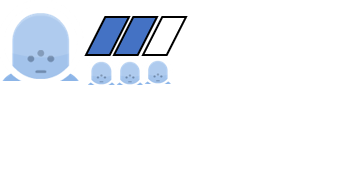

En este modo de juego nos interesa el número de vidas restantes que tiene cada jugador.

- **¡Pelea por el mando!:**

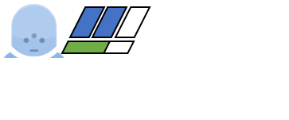

En este modo de juego nos interesa saber el progreso de victoria que lleva cada personaje.

- **Wi-Fight:**

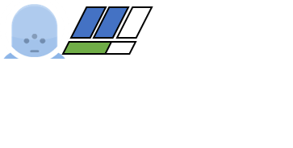

Al igual que en el modo de juego anterior, en este modo de juego nos interesa saber el progreso de victoria que lleva cada personaje.

- **Capitalismo:**

En este modo de juego nos interesa saber el número de monedas que ha ganado cada jugador y el número necesario de monedas para ganar. 
Como en este modo los jugadores no pueden morir, no será necesario representar el número de vidas.

### 4.7 Escenarios:

*En este apartado enumeramos todos los módulos diseñados con los elementos y peligros que contienen, además de un pequeño dibujo conceptual.*

- **Gimnasio:**

	- **Mancuernas:** Estarán repartidas por el escenario y el jugador podrá recogerlas para lanzar a sus enemigos.
	
	- **Cintas de correr:** Al pasar por encima de ellas, los jugadores serán lanzados hacia la dirección a la que estén apuntando las cintas. Van girando sobre sí mismas.
	
	- **Colchonetas:** Permiten el rebote del jugador.
	
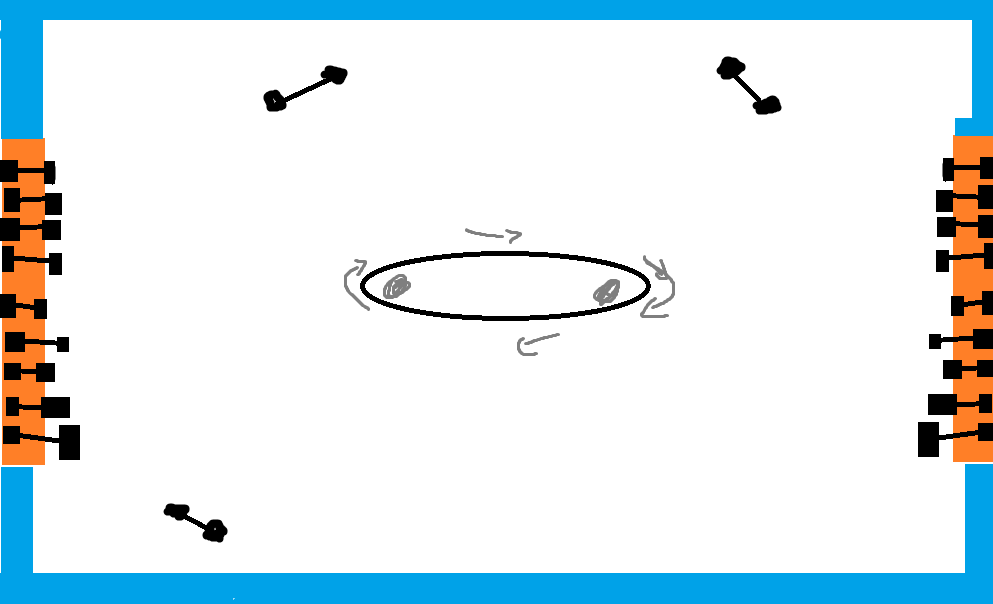

- **Sala de máquinas:**

	- **Caldera:** En el centro de la arena hay una caldera que expulsa bolas de fuego periódicamente.
	- 
- **Botones:** Se pueden activar con un disparo o con un golpe. Permiten la aceleración o la deceleración del horno, depende del tipo de botón que sean.
	
	- **Bolas de fuego:** Al tocarlas, el jugador arderá recibirá daño. Cuando toquen una pared, desaparecerán.
	
	- **Tuberías:** Plataformas estáticas repartidas por el escenario a las que el jugador se puede agarrar.
	
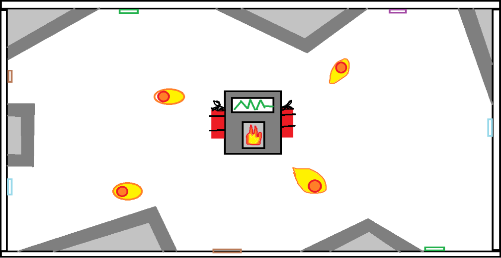

- **Jardin botánico:**
	
	- **Plataneros:** Generan plátanos pistola.
	
	- **Tomateras:** Generan tomates granada.
	
	- **Plantas carnívoras:** Devoran a los jugadores que se acerquen a ellas. Cada vez que un jugador esté colisionando con una, se irán poniendo cada vez más nerviosas hasta que finalmente muerdan a quien esté dentro en ese momento, matando instantáneamente.

- **Cocina:**

	- **Nevera:** Expulsa alimentos periódicamente. Los alimentos se pueden lanzar a los enemigos.
	
	- **Mesa magnética:** Se activa al presionar un botón. Al estar activa, atrae todos los objetos metálicos a alta velocidad hacia ella, haciendo daño a los jugadores a su paso.
	
	- **Utensilios de cocina:** Funcionan como armas arrojadizas.
	
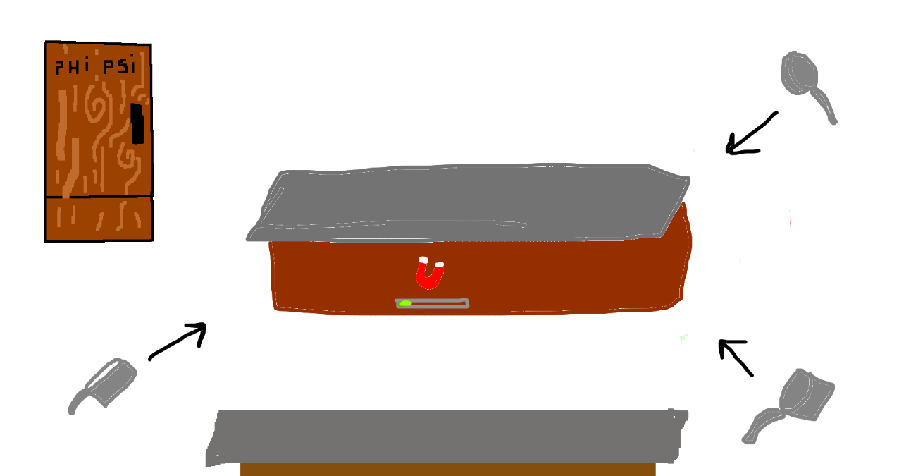
	
- **Sala de estar:**

*No hay peligros mortales para el jugador, pero hay una multitud de objetos que los jugadores se pueden arrojar (sillas, lámparas…)*

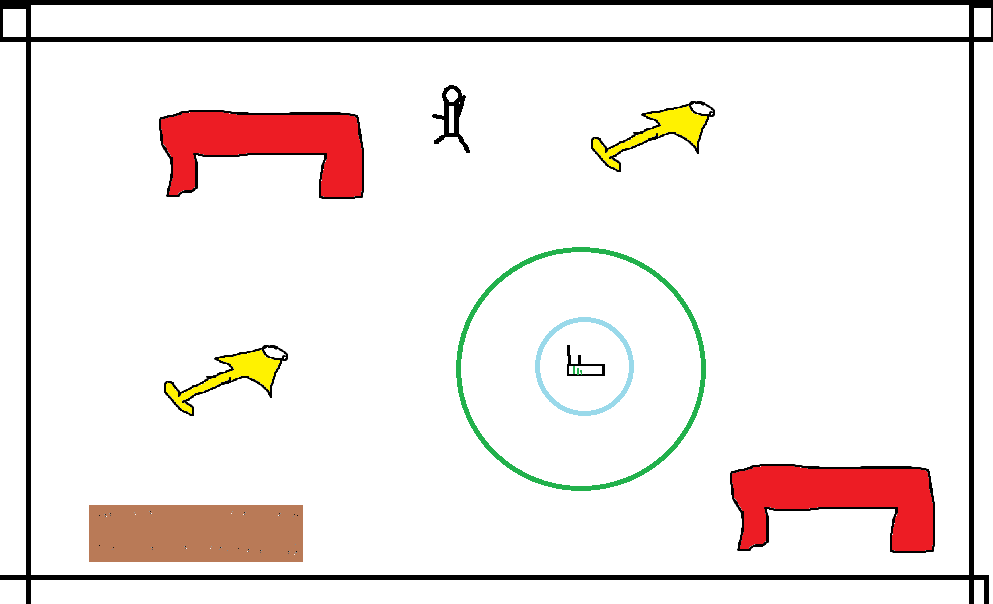

- **Entrada de la estación:**

	- **Compuertas:** Hay 4 repartidas por el escenario. Estas se irán abriendo de forma regular cada cierto tiempo. Antes de abrirse, un muro dividirá la sala en secciones. De este modo, si el jugador escapa de la sección que va a ser abierta al espacio, sobrevivirá. Si un jugador sale lanzado al espacio, morirá.
	
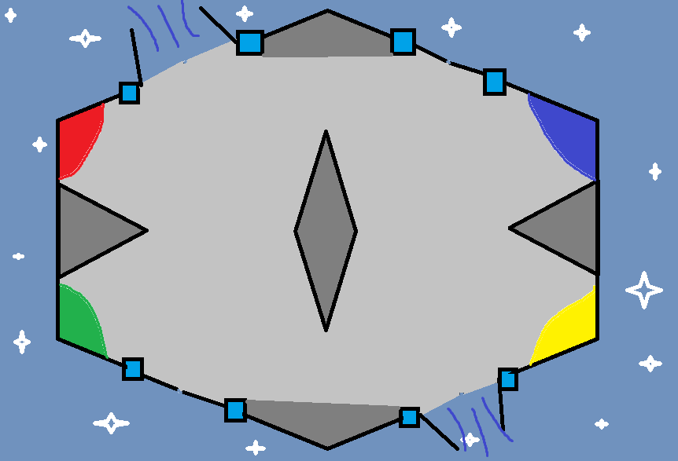

## 5. Banda Sonora Original

El juego cuenta con música compuesta por gente del grupo. De momento hay planeadas 7 pistas:

 1. **Main Menu**
	 La pista que sonará en el menú principal.
 2. **Entrance to the Spacial Station (sonará en el mapa de la entrada a la estación)**
	 Sonará en el mapa de la entrada en la estación (a fecha de la release inicial esta pista no se utiliza en el juego).
 3. **Living Room Chaos Theme (sonará en el mapa del salón)**
	 Suena en el mapa del salón.
 4. **Gym Fight**
     Suena en el mapa del gimnasio. Inspirada en la música de los vídeos de ejercicios de televisión del siglo pasado.
 5. **Explosion inside the Boiler Room**
	 Suena en la sala de calderas.  Para muchos considerada como una pista de culto, recuerda a la música de algún jefe final.
 6. **Learning to Play**
	 Suena en el tutorial. Puede que haya sido utilizada con anterioridad en alguna presentación en Minecraft.
 7. **Take Care of your veggies**
	 Suena en el jardín botánico. Simboliza el veganismo del Programa de Convivencia Espacial.

## 6. Juego Online

El Programa de Convivencia Espacial cuenta con juego online. De momento, funcionará en red local (para jugar a distancia hay que abrir puertos). El host es el que tiene el juego como tal funcionando, y cada cliente le envía su input y recibe las imágenes y sus posiciones correspondientes (sin llevar nada del peso de la lógica del juego).

## 7. Referencias:
Para hacer el PCE, se ha intentado seguir el ejemplo de algunos juegos, entre los que contamos:

 - **Duck Game (2014, Landon Podbielski)**, por su sistema de partidas frenéticas y relativamente rápidas, hechas para que sea fácil y divertido de jugar.
 - **Gang Beasts (2014, Boneloaf)**, por su multijugador caótico que, a pesar de no ser increíblemente claro y preciso de controlar, logra crear dinámicas de partida interesantes.

## 8. Carta a los reyes magos:

*En este apartado exploramos nuevas mecánicas o contenido que querríamos añadir al juego, pero dado al nivel de incertidumbre que existe ahora mismo en el desarrollo no estamos cómodos en añadirlos al GDD.*

- Modos de juego configurables
- Otras estaciones (Meteosat…)
- Modo ‘historia’
- Al ser derrotados, los astronautas salen disparados de su traje y vuelven a la base para ponerse otro.

	
	
	

	

