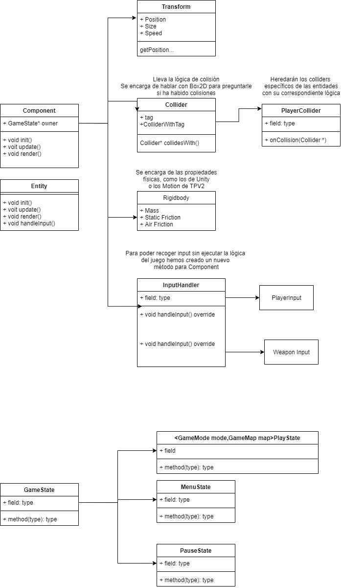

# Arquitectura del proyecto

Se han determinado los siguientes patrones de diseño a la hora de desarrollar PCE.
Hay libertad de escribir el código como sea más cómodo y escalable dentro de estos patrones.

## Patrones de diseño

* **Arquitectura por componentes:** Al igual que en TPV2 los estados de juego gestionarán una lista de entidades con componentes. Se pueden crear **componentes mediante herencia**, pero las entidades no tendrán subclases.

* **Singleton:** Habrá un único singleton, GameManager, que gestionará la comunicación entre objetos del juego. Cualquier otro "manager", encargado de texturas/sonido será únicamente accesible desde el GameManager para mantener el código limpio.

* **Máquina de estados:** Usaremos una pila al igual que en TPV1, usaremos una pila de estados para facilitar la vuelta al estado anterior. Se añadirán un estado de partida, 
  que dicta el modo en el que se suceden las rondas de juego y un PlayState, que recibirá por parámetro el tipo de juego y el mapa.

	
## Diagrama de clases
Esta será la arquitectura básica del proyecto que encapsula las facetas generales de una entidad. 
Componentes como el collider de una bola de fuego que mata al jugador o un área de efecto deben heredar de collider
al igual que el input se debe recoger de una clase que herede de InputHandler. Las clases que se salgan de este funcionamiento general como un componente Health que sólo es una colección de atributos y lógica
pueden heredar directamente de Component.

## Librerías

* **SDL2:** a pesar de la tentativa de Carlos León para usar Unreal.

* **Box2D:** como motor de físicas.

* **SDL2_TTF:** como librería de texto.

* **SDL2_Mixer:** como librería de audio.

* **SDL2_Net:** como librería de conexión de red.

# Multijugador online

El multijugador funciona con un sistema de clientes 'tontos', el host (jugador 0) se encarga de hacer el bucle principal del juego y el resto de jugadores reciben solo la información de los sprites en pantalla.

## Host

* **Envío de datos**: A medida que el host renderiza las entidades del juego, va enviando la información del sprite renderizado a los clientes.

* **Manejo del input**: Antes de empezar el ciclo de juego, el host recibe el estado de los controles del resto de jugadores y lo guarda, lo utiliza como cualquier otro binder de control a la hora de hacer los cálculos usuales del ciclo.

## Cliente

Los clientes solo se tienen que preocupar de registrar el input de su jugador y recibir la información del host.

* **Input:** El cliente recibe el input de su mando, lo codifica y lo envía al host.

  * Codificación: [pendiente]

* **Renderizado:** Recibe la información de cada uno de los sprites que tiene el host en pantalla, y los renderiza según le vayan llegando.
