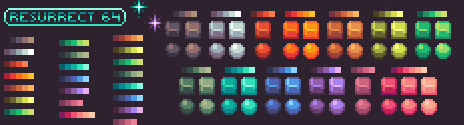
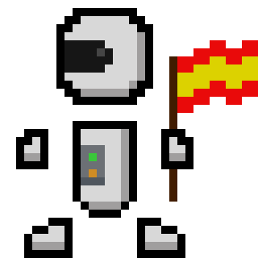

# Assets

## Sprites

* **Estilo:** por el momento, los sprites tanto de los jugadores como de las armas y otros objetos "movibles" tendrán un estilo pixel art con una resolución media baja (alrededor de 32 pixeles de alto por jugador). Se usará un reborde negro para los jugadores y otros elementos de importancia, como por ejemplo las partes interaccionables del mapa

* **Paleta:** usamos una paleta creada por Kerrie Lake y basada en tonos pastel, pero relativamente intensos:

* **Animacion:** los jugadores y elementos pertinentes del entorno estarán animados, además, los cadáveres de los personajes tendrán animación tipo _ragdoll_, moviéndose con las físicas libremente

	

	
	
## Sonido

* **Efectos de sonido:** utilizaremos sonidos generados por nosotros (con paginas como [as3sfxr], [ChipTone] o [Bfxr]) asi como efectos descargados de internet.

* **Música:** se encarga Jorge, a mi no me mires.

[as3sfxr]: http://www.superflashbros.net/as3sfxr/
[ChipTone]: https://sfbgames.com/chiptone/
[Bfxr]: https://www.bfxr.net/
